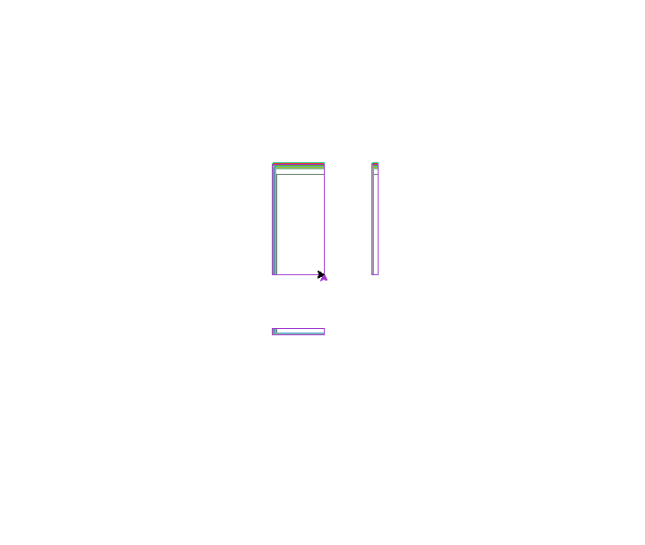

# Phone Dimensions Comparison using Turtle
A simple script using the Turtle module and a text file containing phone dimensions to draw an image comparing phone sizes and saving the output in .EDF and .PNG formats.
  

  

